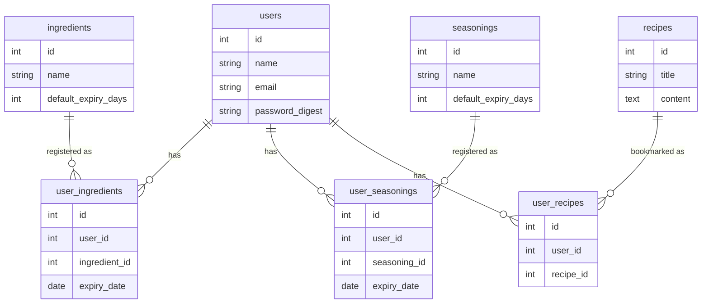

# StockDish

## 概要

StockDish(ストックディッシュ)は、家庭にある調味料・食材を登録し、OpenAI APIを使ってレシピを提案してもらえるWebアプリケーションです。

ユーザーが手動で食材・調味料を登録 → AIがレシピを提案 → 提案されたレシピを保存・蓄積していくことで、ユーザー間で共有されるレシピDBが育っていく、というコンセプトで開発しています。

## 技術スタック

| 領域 | 技術 |
|---|---|
| 言語/フレームワーク | Ruby 3.4 / Rails 8.1.3 |
| DB | PostgreSQL |
| フロントエンド | ERB + Tailwind CSS |
| AI | OpenAI API |
| インフラ | Docker / Render |
| 認証 | has_secure_password(自前実装) |

### 技術選定の理由

**なぜRailsか**
学習効率と開発スピードを重視。Railsの規約(Convention over Configuration)に従うことで、MVCの責務分離を実践的に学べると考えたため。

**なぜhas_secure_passwordか(Deviseではなく)**
Deviseは便利だが内部処理がブラックボックス化しやすい。認証の仕組み(パスワードのハッシュ化、セッション管理など)を自分で実装することで、Webアプリのセキュリティの基礎を理解する目的で採用。

**なぜPostgreSQLか**
Renderでのデプロイを想定し、本番環境でも安定して使える点、Railsとの相性の良さから選定。

## 今後の拡張予定

MVPリリース後、以下の構成への移行を計画しています。

- バックエンド: Rails API モード化
- フロントエンド: React(Next.js)へ移行
- 画像認識: 冷蔵庫の写真から食材を自動認識するFastAPIマイクロサービスを追加
- インフラ: AWS(EC2 / RDS / S3)+ Nginx + Redis + GitHub Actionsでの本番運用

## DB設計

7つのテーブルで構成しています。

### テーブル概要

- **users**: ユーザー情報(認証含む)
- **ingredients / seasonings**: 食材・調味料のマスタデータ(共有DB)
- **user_ingredients / user_seasonings**: ユーザーごとの在庫(中間テーブル)
- **recipes**: OpenAI APIで生成されたレシピ(共有DB、ユーザー間で蓄積)
- **user_recipes**: ユーザーがブックマークしたレシピ(中間テーブル)

`ingredients`と`seasonings`はユーザー間で共有されるマスタデータとして設計し、登録されたデータがアプリ全体の資産として蓄積されていく構成になっています。